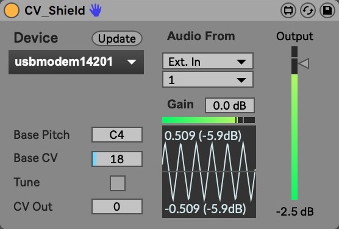

# Ableton Live でCV-Shieldを使う

CV-Shieldを外部MIDI楽器のような気持ちで使うことができます。

## 使い方
### Arduinoの準備
1. [`PacketSerial`](https://github.com/bakercp/PacketSerial)というライブラリをArduino IDEのLibrary Managerからインストールする。
2. ArduinoをPCに接続し、`Ableton.ino`をArduinoに書き込む。
3. Arduino IDEを終了する。

### 接続
1. CV-ShieldをArduinoに載せる。
2. CV-ShieldのD3出力をVCOのCV INに接続する。
3. VCOのAudio OUTをオーディオインターフェイスに接続する。

### Liveで使う
1. `CVShield Project/CVShield.als`を開く。
2. 1つめのトラックに`CV-Shield`のデバイスが接続されているはずである。
3. Deviceの`Update`ボタンを押す。
4. 下のリストから、Arduinoが接続されているポートを選択する。
5. 中央上部、`Audio From`をインターフェイスの適切なチャンネルに指定する。
6. 左下`Tune`の横のボタンを押す。黄色くなる。  
   周波数解析が始まり、MIDIノートとの対応がなされる。
7. 黄色が消えるまで待つ。
8. キーボードなどでMIDIを入力する。

## 備考
- `Base Pitch`は周波数解析の際に基準とするMIDIのピッチです。この音を基準とした周波数比に応じてCVが自動で設定されます。
- `Base CV`は基準となる`Base Pitch`に最も近い`analogWrite()`の値です。
- `Tune`が行われている間はオーディオが鳴りません。
- `CV Out`は現在出力されている`analogWrite()`の値です。
- `Gain`は入力に対して増幅が可能です。
