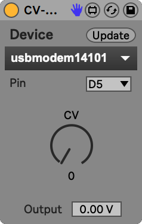

# Ableton Live でCV-Shieldを使う
   
CV-Shieldを外部MIDI楽器のような気持ちで使うことができます。MIDIノートのピッチに応じてCVを出すInstデバイスとシンプルに設定した値でCVを出力するEffectデバイスがあります。

## 使い方
### Arduinoの準備
1. [`PacketSerial`](https://github.com/bakercp/PacketSerial)というライブラリをArduino IDEのLibrary Managerからインストールする。
2. ArduinoをPCに接続し、`Ableton.ino`をArduinoに書き込む。
3. Arduino IDEを終了する。

### 接続
1. CV-ShieldをArduinoに載せる。
2. CV-ShieldのD3出力をVCOのCV INに接続する。
3. VCOのAudio OUTをオーディオインターフェイスに接続する。

###  Instモード
トラックに入力されたMIDIノートの音程に応じたCVを出力します。VCOに使うことを想定しています。

1. CV-Shield.InstをMIDIトラックに追加する。
2. Deviceの`Update`ボタンを押す。
3. 下のリストから、Arduinoが接続されているポートを選択する。
4. その下のPinから適切な出力ピンを選ぶ。
5. 中央上部、`Audio From`をインターフェイスの適切なチャンネルに指定する。
6. 左下`Tune`の横のボタンを押す。黄色くなる。  
   周波数解析が始まり、MIDIノートとの対応がなされる。
7. ボタンの黄色が消えるまで待つ。
8. キーボードなどでMIDIを入力する。

### Effectモード
つまみの値に応じてCVを出力します。  

1. CV-Shield.InstをMIDIトラックに追加する。
2. Deviceの`Update`ボタンを押す。
3. 下のリストから、Arduinoが接続されているポートを選択する。
4. その下のPinから適切な出力ピンを選ぶ。
5. `CV`つまみを回す。

## 備考
- Instモード
   - `Base Pitch`は周波数解析の際に基準とするMIDIのピッチです。この音を基準とした周波数比に応じてCVが自動で設定されます。
   - `Base CV`は基準となる`Base Pitch`に最も近い`analogWrite()`の値です。
   - `Tune`が行われている間はオーディオが鳴りません。
   - `CV Out`は現在出力されている`analogWrite()`の値です。
   - `Gain`は入力に対して増幅が可能です。
- Effectモード
   - `Output`は出力電圧の参考用です。単純に掛け算をしているだけなので実際の値とは異なる場合があります。
